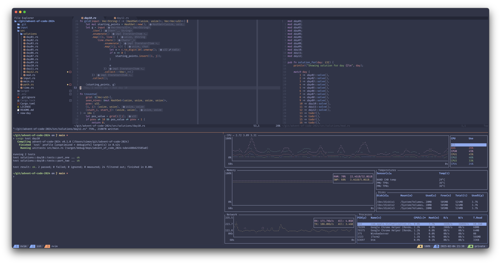

# 💻 dotfiles

My personal dotfiles. Combination of configuration for tools used both under
macOS, Linux and Windows.

## Install

## Prerequisites

- [just]

For `nvim` plugins you often need the related toolchain such as`npm`, `go`,
`python`/`pip`, `cargo` etc.

## Other configuration

### Shell

I use `zsh` in all environments and all OSes. This is also used together with
[oh-my-zsh].

### tmux

To auto run `tmux` and start the **same** session as always (default 'main'
session) configure the terminal to auto run the following command in the shell
when started:

```sh
tmux new-session -A -s main
```

## Color palette

I'm currently using [Catppuccin Frappe] which supports most of the editors, CLI
tools, terminal applications etc that I use.



## Font

I use [Fira Code Nerd Fonts][Fira Code] wherever possible. Yes, with ligatures!

[Catppuccin Frappe]: https://github.com/catppuccin/catppuccin
[Fira Code]: https://github.com/ryanoasis/nerd-fonts/tree/master/patched-fonts/FiraCode
[just]: https://github.com/casey/just
[oh-my-zsh]: https://ohmyz.sh
