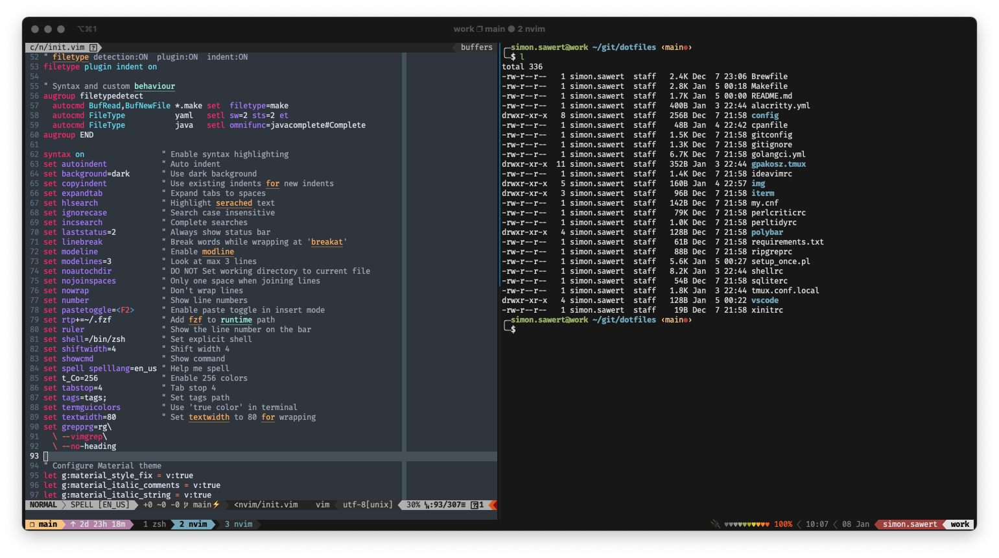

# 💻 dotfiles

My personal dotfiles. Combination of configuration for tools used both under
macOS, Linux and Windows. I use multiple setups depending on my workflow and
switch over time so the most curated files will be related to my current setup.

## Install

## Prerequisites

I used to curate a list of dependencies for easy installation and I still
occastionally dump my `Brewfile`. However, I currently think the best way to
setup prerequisites such as `node`/`npm`, Python modules, linters etc. is to do
it manually whenever I setup a new machine. This is less maintenance and will
ensure it's done the currently suggested way.

## Other configuration

### Shell

Since Apple made the move from `bash` to `zsh` with macOS 10.15 I switched all
my terminals in all OSes to use `zsh`. It's just to install in any preferred
way and change the default shell.

```sh
sudo bash -c 'echo /path/to/zsh >> /etc/shells'
chsh -s /path/to/zsh
```

This is also used together with [oh-my-zsh](https://ohmyz.sh/).

### tmux

To auto run `tmux` and start the **same** session as always (default 'main'
session) configure the terminal to auto run the following command in the shell
when started:

```sh
tmux new-session -A -s main
```

When shell is changed (i.e `chsh -s /usr/local/bin/fish`), the tmux server must
be restarted with `tmux kill-server` for changes to take effect.

## Color palette

The current theme used in both vim and VS Code is
[Material](https://material-theme.site/). For iTerm2 i use the
`base16-default-dark-256` from
[base16-iterm2](https://github.com/martinlindhe/base16-iterm2) repository found
here (and also saved in `iterm/profiles.json`.

The colors from the base16 theme is also used for tmux as seen in
`tmux.conf.local`.


