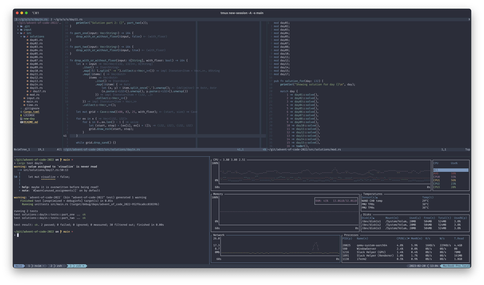

# 💻 dotfiles

My personal dotfiles. Combination of configuration for tools used both under
macOS, Linux and Windows.

## Install

## Prerequisites

- [just](https://github.com/casey/just)

For `nvim` plugins you need `npm`, `go` and `python`/`pip`.

## Other configuration

### Shell

I use `zsh` in all environments. For OSes where this is not the default shell,
change with:

```sh
sudo bash -c 'echo /usr/bin/zsh >> /etc/shells'
chsh -s /usr/bin/zsh
```

This is also used together with [oh-my-zsh](https://ohmyz.sh/).

### tmux

To auto run `tmux` and start the **same** session as always (default 'main'
session) configure the terminal to auto run the following command in the shell
when started:

```sh
tmux new-session -A -s main
```

## Color palette

I'm currently using [Catppuccin
Frappe](https://github.com/catppuccin/catppuccin) for `nvim`, `tmux` and
[iTerm2](https://github.com/catppuccin/iterm).


