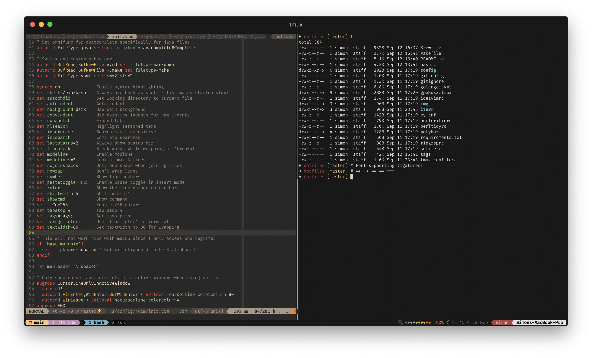

# dotfiles

My personal dotfiles. Combination of configuration for tools used both under
macOS and Linux.

## Install

A simple makefile can help install.

```
# Clone repository
mkdir -p ~/git
git clone git@github.com:bombsimon/dotfiles.git ~/git/dotfiles

# Install
cd ~/git/dotfiles && make \
    links \
    source \
    bash_completion
```

### New Computer Flow

When installing a completely new computer, not everything in this repository
will be set up. I don't like `brew cask` for graphical applications so for now I
download them manually. Maybe I'll try `cask` in the future.

* Setup computer accounts
  * Sign in with AppleID
  * Enable Google account
  * Enable Outlook Exchange Account
* Edit keyboard shortcuts
  * Spotlight - `^`+`[Space]`
  * Change save vs. copy screenshot, i.e. `⇧`+`⌘`+`3` 🔄 `⇧`+`^`+`⌘`+`3`
  * Map `Caps Lock`to `Esc`
  * Disable `^`+`Arrows` for Mission Control (used for tmux)
  * In the shortcuts menu, set `Full Keyborad Access` to `All controls` to support tabbing between buttons
  * Under `Accessability`, enable scroll gesture to zoom
* Install non-brew applications
  * [1Password](https://1password.com/downloads/mac/)
  * [Discord](https://discordapp.com/download)
  * [Docker for Mac](https://hub.docker.com/editions/community/docker-ce-desktop-mac)
  * [Dropbox](https://www.dropbox.com/)
  * [GoLand](https://www.jetbrains.com/go/?fromMenu)
  * [Go](https://golang.org/dl/)
  * [Google Backup and Sync](https://www.google.com/drive/download/backup-and-sync/)
  * [Google Chrome](https://www.google.com/chrome/)
  * [Haskell (ghcup)](https://www.haskell.org/ghcup/)
  * [IntelliJ](https://www.jetbrains.com/idea/download/#section=mac)
  * [Java JDK](https://www.oracle.com/technetwork/java/javase/downloads/jdk12-downloads-5295953.html)
  * [Spotify](https://www.spotify.com/se/download/mac/)
  * [Xcode](https://developer.apple.com/xcode/)
  * [iStat Menus](https://bjango.com/mac/istatmenus/)
  * [iTerm2](https://www.iterm2.com/downloads.html)
* Setup iTerm2
  * Optionally install [Powerline fonts](https://github.com/powerline/fonts) if not going to use [Fira Code](https://github.com/tonsky/FiraCode).
  * Import profile from `dotfiles`
* Setup GitHub settings
  * Import (or create) GPG key; `gpg --import gpg-key.asc`
  * Create new SSH-key and upload to GitHub; `ssh-keygen -t ECDSA`
  * Configure `~/.ssh/config`

```sh
Host github.com
  HostName github.com
  Port 22
  User git
  IdentityFile ~/.ssh/<github-ssh-key>
  IdentitiesOnly yes
  ForwardAgent yes
```
* Continue with Makefile for final setup!

## Prerequisites

Most of the things used is setup with Brew, however the configuration should
also work under other Linux. The setup for
[`coc.vim`](https://github.com/neoclide/coc.nvim) is the one which is most
special so remmber to read the installation notes. All required Python
dependencies can be installed by running `pip install --upgrade -r
requirements.txt`

### neovim

As seen in [`neovim config`](config/nvim/init.vim) there are a few fixers and
linters applied. For other things such as auto installing
[vim-plug](https://github.com/junegunn/vim-plug) toos like
[curl](https://curl.haxx.se/) is required. The list below shows all dependencies
used.

* [Black](https://github.com/python/black)
* [ctags](https://ctags.io/)
* [curl](https://curl.haxx.se/)
* [eslint](https://eslint.org/)
* [flake8](http://flake8.pycqa.org/en/latest/)
* [golangci-lint](https://github.com/golangci/golangci-lint)
* [jq](https://stedolan.github.io/jq/)
* [nodejs](https://nodejs.org/en/)
* [perltidy](https://metacpan.org/pod/perltidy)*
* [pylint](https://www.pylint.org/)
* [rubocop](https://github.com/rubocop-hq/rubocop)**
* [yarn](https://yarnpkg.com/en/)

*\* Should be installed with [Perlbrw](https://perlbrew.pl/)*

```sh
\curl -L https://install.perlbrew.pl | bash
perlbrew install perl-5.30.0
perlbrew install-cpanm
```

*\*\* Should be installed with [RVM](https://rvm.io)*

```sh
\curl -sSL https://get.rvm.io | bash -s stable --rails
```
## Other configuration

### tmux

To auto run `tmux` and start the **same** session as always (default 'main'
session) configure the terminal to auto run the following command in the shell
when started:

```sh
tmux new-session -A -s main
```

When shell is changed (i.e `chsh -s /usr/local/bin/fish`), the tmux server must
be restarted with `tmux kill-server` for changes to take effect.

### Color palette

As seen in neovim config the current theme used is
[Gruvbox](https://github.com/morhetz/gruvbox). For iTerm2 i use the
`base16-default-dark-256` from
[base16-iterm2](https://github.com/martinlindhe/base16-iterm2) repository found
here (and also saved in `iterm/profiles.json`.

The colors from the base16 theme is also used for tmux as seen in
`tmux.conf.local`.



### macOS defaults

Some variables used by macOS is set by writing defaults. For example, if the
maximum key repeat available to set from the system preferences, a way to set
them even lower would be by writing defaults.

```sh
defaults write -g InitialKeyRepeat -int 10 # normal minimum is 15 (225 ms)
defaults write -g KeyRepeat -int 1         # normal minimum is 2 (30 ms)
```